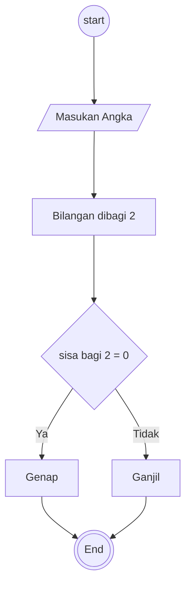

# Flowchart bilangan genap dan ganjil

```mermaid
flowchart TB

Start((start)) ---> MasukanAngka[/Masukan Angka/]
MasukanAngka[/Masukan Angka/] ---> BilanganDibagi[Bilangan dibagi 2]
BilanganDibagi[Bilangan dibagi 2] ---> Decision{sisa bagi 2 = 0}
Decision{sisa bagi 2 = 0} -- Ya --> Genap --> Stop((Stop))
Decision{sisa bagi 2 = 0} -- Tidak --> Ganjil --> Stop(((End)))
```