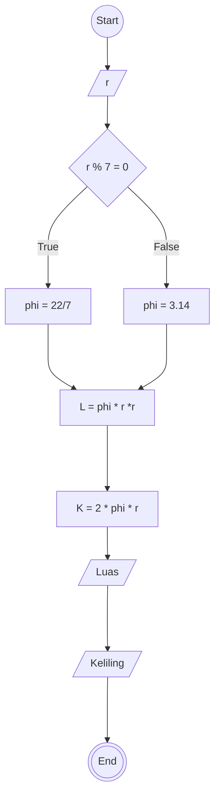

# Flowchart program menghitung luas dan keliling lingkaran

```mermaid
flowchart TD
Start((Start)) --> JariJari[/r/] --> Decision{r habis dibagi} -- True --> Phi[phi = 22/7] ---> luas[L = phi * r *r]

Decision{r % 7 = 0} -- False ---> Phi2[phi = 3.14] --->luas[L = phi * r *r]

luas[L = phi * r *r] ---> Keliling[K = 2 * phi * r] --> HasilL[/Luas/] --->HasilK[/Keliling/] --->End(((End)))
```