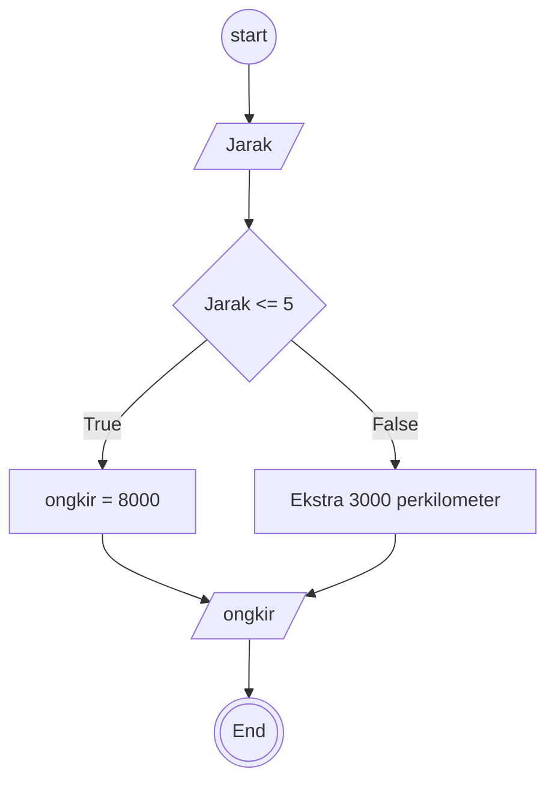

# Flowchart Ongkir

```mermaid

flowchart TD


Start((start)) --> Jarak[/Jarak/] --> Decision{Jarak <= 5} -- True -->ongkir1[ongkir = 8000] -->ongkir[/ongkir/]

Decision{Jarak <= 5} -- False -->ongkir2[Ekstra 3000 perkilometer]  -->ongkir[/ongkir/] --> Stop(((End))) 
```

