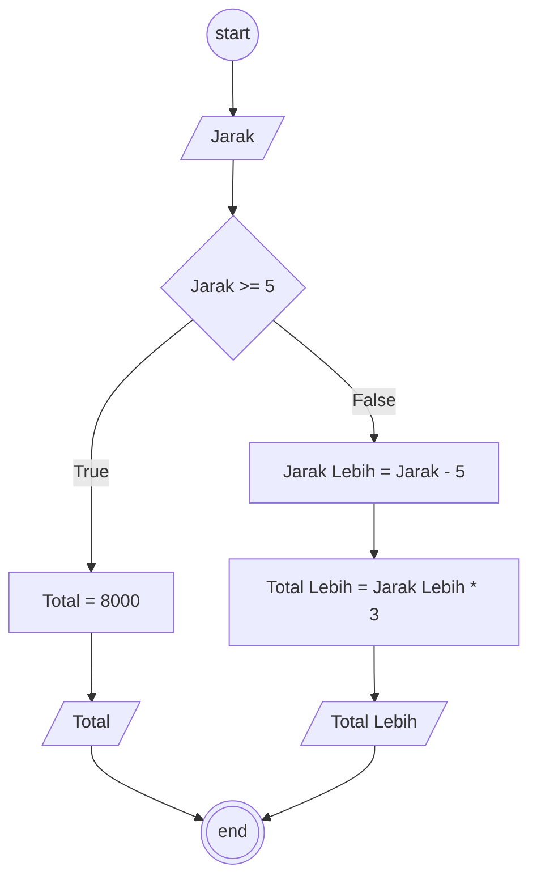

# Flowchart Ongkir

```mermaid

flowchart TD


Start((start)) --> Jarak[/Jarak/] --> Decision{Jarak >= 5} -- True -->ongkir1[Total = 8000] -->TotalLebih[/Total/] -->End(((end)))

Decision{Jarak >= 5} -- False -->ongkir2[Jarak Lebih = Jarak - 5]  -->ongkir[Total Lebih = Jarak Lebih * 3] -->JarakLebih[/Total Lebih/] -->End(((end)))
```

