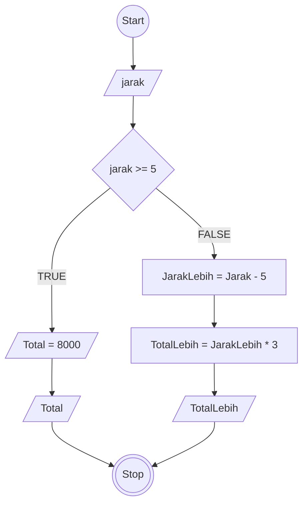

# Flowchart Ongkir

```mermaid

flowchart TD

START@{shape: circ, label: "Start"}
STOP@{shape: dbl-circ, label: "Stop"}

JARAK@{shape: lean-r, label: "jarak"}
DECISIONJARAK@{shape: diam, label: "jarak >= 5"}

JARAKLEBIH@{shape: rect, label: "JarakLebih = Jarak - 5"}
TOTALLEBIH@{shape: rect, label: "TotalLebih = JarakLebih * 3"}

TOTALLEBIH2@{shape: lean-r, label: "TotalLebih"}

TOTAL@{shape: lean-r, label: "Total = 8000"}
TOTAL2@{shape: lean-r, label: "Total"}


START-->JARAK
JARAK-->DECISIONJARAK
DECISIONJARAK--TRUE-->TOTAL
DECISIONJARAK--FALSE-->JARAKLEBIH

JARAKLEBIH-->TOTALLEBIH
TOTALLEBIH-->TOTALLEBIH2    

TOTAL-->TOTAL2
TOTAL2-->STOP
TOTALLEBIH2-->STOP
```

