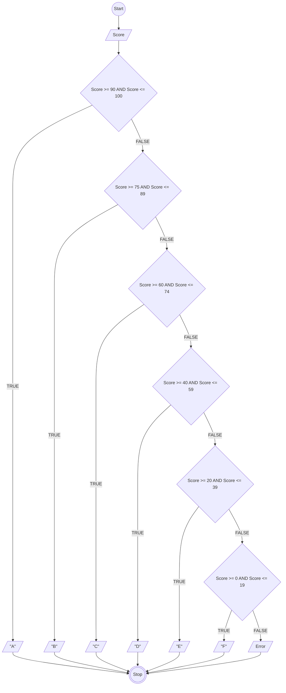

# Flowchart

```mermaid
flowchart TD

START@{shape: circ, label: "Start"}
STOP@{shape: dbl-circ, label: "Stop"}


SCR@{shape: lean-r, label: "Score"}

GRADEA@{shape: lean-r, label: '"A"'}
GRADEB@{shape: lean-r, label: '"B"'}
GRADEC@{shape: lean-r, label: '"C"'}
GRADED@{shape: lean-r, label: '"D"'}
GRADEE@{shape: lean-r, label: '"E"'}
GRADEF@{shape: lean-r, label: '"F"'}

ERR@{shape: lean-r, label: Error}


CONDA@{shape: diam, label: Score >= 90 AND Score <= 100}
CONDB@{shape: diam, label: Score >= 75 AND Score <= 89}
CONDC@{shape: diam, label: Score >= 60 AND Score <= 74 }
CONDD@{shape: diam, label: Score >= 40 AND Score <= 59}
CONDE@{shape: diam, label: Score >= 20 AND Score <= 39}
CONDF@{shape: diam, label: Score >= 0 AND Score <= 19}

START-->SCR

SCR-->CONDA

CONDA--TRUE-->GRADEA
CONDA--FALSE-->CONDB
CONDB--TRUE-->GRADEB
CONDB--FALSE-->CONDC
CONDC--TRUE-->GRADEC
CONDC--FALSE-->CONDD
CONDD--TRUE-->GRADED
CONDD--FALSE-->CONDE
CONDE--TRUE-->GRADEE
CONDE--FALSE-->CONDF
CONDF--TRUE-->GRADEF
CONDF--FALSE-->ERR

ERR-->STOP
GRADEA-->STOP
GRADEB-->STOP
GRADEC-->STOP
GRADED-->STOP
GRADEE-->STOP
GRADEF-->STOP


```
