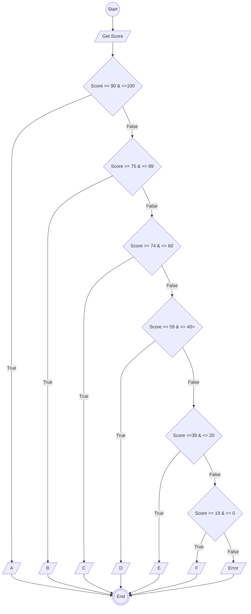

# Flowchart Score

```mermaid

flowchart TD

Start((Start))--> Grade[/Get Score/] -->Score{Score >= 90 <=100} -- True -->A[/A/] -->End(((End)))


Score{Score >= 90 & <=100} -- False -->ScoreB{Score >= 75 & <= 89} -- True -->B[/B/] -->End(((End)))

ScoreC{Score >= 74 & <= 60} -- True -->C[/C/] -->End(((End)))

ScoreB{Score >= 75 & <= 89} -- False -->ScoreC{Score >= 74 & <= 60} -- False -->ScoreD{Score >= 59 <= 40>} -- True --->D[/D/] -->End(((End)))


ScoreD{Score >= 59 & <= 40>} -- False --->ScoreE{Score >=39 <= 20} -- True -->E[/E/] -->End(((End)))


ScoreE{Score >=39 & <= 20} -- False -->ScoreF{Score >= 19 <= 0} -- True -->F[/F/] -->End(((End)))

ScoreF{Score >= 19 & <= 0} -- False -->Error[/Error/] -->End(((End))) 

```